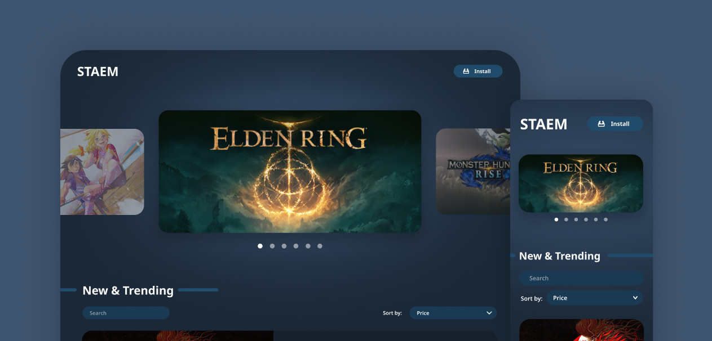

# I Design, You Build - Frontend Challenge

Challenge created by [Zernonia](https://blog.zernonia.com) to improve techniques as a frontend developer

## About Challenge

[I Design, You Build! - Frontend Challenge](https://blog.zernonia.com/i-design-you-build-frontend-challenge-4-supabase-version)

Create a landing page like the [layout](https://www.figma.com/file/v9WwrvuGFZHVLy4z3wxHGi/STAEM?node-id=3%3A2) created by [Zernonia](https://blog.zernonia.com) using fetch to consume the API and include filters and search.

### Targets

- 🎯 Fetch from provided API
- 🎯 Search games by name
- 🎯 Sort games by "Price", "Name"
- 🎯 Carousel item
- 🎯 Responsive design
- 🎯 External link to game's page on Steam

**Layout**: https://www.figma.com/file/v9WwrvuGFZHVLy4z3wxHGi/STAEM?node-id=3%3A2

**API Endpoint**: https://www.supadb.dev/steam

### Live demo

**Live demo**: soon
